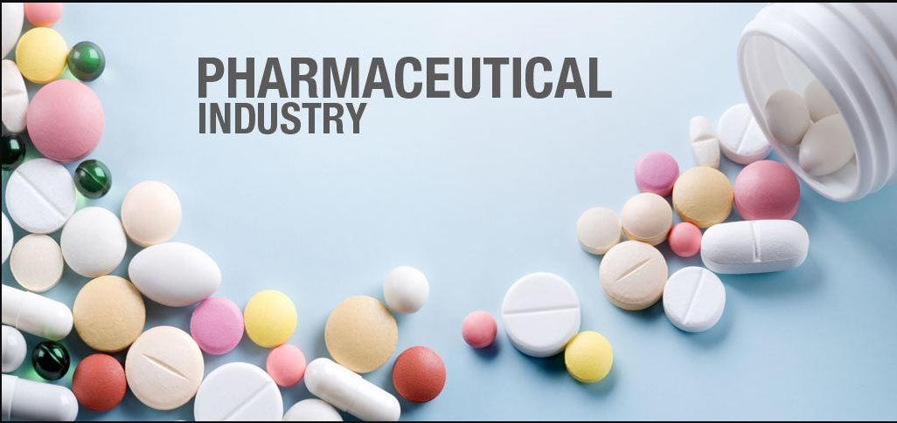
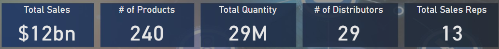
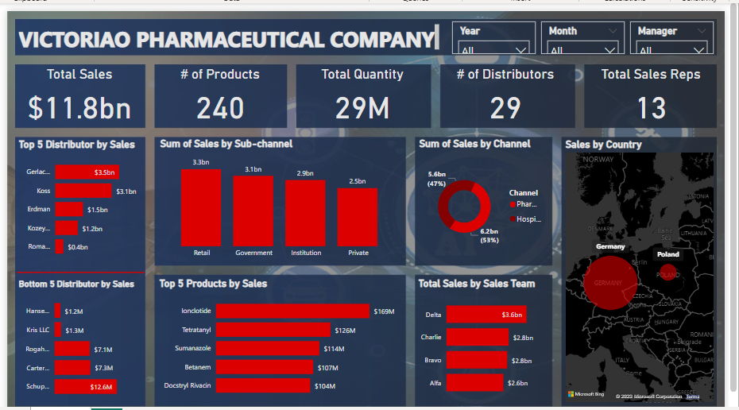
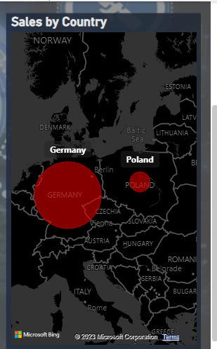

# Pharmaticeutical-Sales-Analysis

The aim of this project is to exhibit my skills analyzing and visualizing the pharmaceutical data using Power BI.

## Introduction
**Victoriao Pharmaceuticals Company** is one of the leading Pharmaceutical Manufacturing companies with a global presence. Their Markets are divided into different regions across the world. One of those regions manages the Germany and Poland Markets. But the company does not sell directly to customers. Instead, they work with a couple of Distributors in all their regions. They have an agreement with each of the distributor to share their Sales Data with them. This is to enable them gain insights up to the retail level.

**_Disclaimer_**: _All datasets and reports do not represent any company, institution or country but just a dummy dataset to demonstrate capabilities of Power BI._

## Problem Statement

- Sum of Sales by Channel 
- Top 5 products by Sales
- Top 5 Distributors by Sales
- Buttom 5 Distributors by Sales
- Sales by Country

## Skills Demonstrated

I was able to add to my skill by learning and using the **DAX Query Function**. This can be seen in the calculated **KPIS**.

## Data Transformation/Cleaning:

Data was efficiently cleaned and transformed with the Power Query Editor of Power BI. After checking all the columns and rows, they were found to be valid and devoid of empty cells and errors. The data contains 254083 rows and 18 columns.

- Making first row as headers on the data.

- Datatype then changed from 'DECIMAL' to 'WHOLE NUMBERS'.

- ADDING NEW MEASURES to calculate for the KPIS.

## Data Modelling

The data has only one table and so there was no data modelling done for the analysis.

## Data Analysis and Visuals

1. From our dasboard, it was observed that the total sales generated for the 4 years of business is $11.8bn. The sales made in 2017 = 2.7bn, 2018 = 3.5bn, 
2019 = 2.9bn, 2022 = 2.7bn.    

3. The company has a total of 240 products.

4. A total of 29 distributors, 13 sales representatives.

Sales is highest in the country Germany with almost $11.1bn.

## Conclusions & Recommendations

- From the dashboard, it was observed that the channel that generated the highest sales is **Pharmacy** **$6.2bn** and the **Hospital** generate **$5.5bn sales**.

- **Ionclotide** has the highest sales product of **$169M** followed by **Tetratanly** of **$126M**.

- The **Delta sales team** generated the highest sales of **$3.6bn** and the **Alfa sales team** had the least sales of **$2.6bn**.

- **Gerlach LLC distributor** generated sales of **$3.5bn** which is the highest distributors and **Hansen Group** is the least sales distributor based on our 
analysis.

## Recommendations

- More investigation should be done in France to see and know why sales was only generated in the year 2018 as there was no sales for 2017, 2018 and 2022.

- The top distributors and top sales team should be given incentives and awards this can also encourage others to do well.

- The company should consider hiring more staff to the business. 

- Some top staff should be posted to countries and cities where we have less sales to boost up sales productivity.

Kindly leave feedback and suggestions.

You can reach me on [Twitter](https://twitter.com/vicky_star0), [LinkedIn](https://www.linkedin.com/public-profile/settings?lipi=urn%3Ali%3Apage%3Ad_flagship3_profile_self_edit_contact-info%3BJUw%2FUZ5rQn2PAIP6BAyJLw%3D%3D)

 
